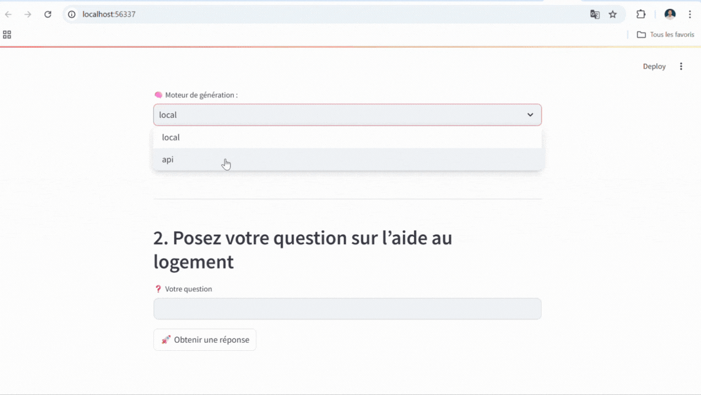

# 🏠 Assistant Logement SCASC

> Un assistant intelligent qui répond aux questions liées aux aides au logement en utilisant des modèles de génération de texte (locaux ou via API) et la méthode RAG (Retrieval-Augmented Generation).

---

## 📂 Structure du projet

```
assistant-logement/
│
├── app_0.py                      # Script principal Streamlit
├── config/
│   └── constants.py             # Clé API et modèles disponibles
├── models/
│   ├── api_models.py            # Chargement des modèles via API (Gemini)
│   ├── local_models.py          # Chargement des modèles locaux (Hugging Face)
│   └── embedder.py              # Embedder + FAISS loader
├── services/
│   └── rag.py                   # Logique RAG principale
├── utils/
│   └── device.py                # Détection GPU ou CPU
├── ui/
│   └── layout.py                # Configuration visuelle de l’app
├── data/
│   ├── faiss_index.index        # Index vectoriel FAISS
│   └── faiss_metadata.json      # Métadonnées associées aux documents
├── README.md                    # Ce fichier
└── requirements.txt             # Dépendances Python
```

---

## 🚀 Fonctionnalités

- 🔍 Récupération intelligente des documents pertinents via FAISS
- 🧠 Génération de texte par modèle local (`Mistral`, `Nous Hermes`, etc.) ou API (`Gemini`)
- 💬 Interface simple via Streamlit
- 📊 Affichage du score de similarité
- 🔌 Mode GPU/CPU détecté automatiquement

---
## 🎥 Aperçu de l'application

<p align="center">
  
</p>


## ⚙️ Prérequis

- Python 3.9+
- Environnement virtuel (recommandé)
- GPU (optionnel mais recommandé pour les modèles locaux)

---

## 📦 Installation

```bash
# 1. Clone du repo
git clone <url-du-repo>
cd assistant-logement

# 2. Création de l'environnement virtuel
python3 -m venv .venv
source .venv/bin/activate  # Linux/macOS
# .venv\Scripts\activate   # Windows

# 3. Installation des dépendances
pip install --upgrade pip
pip install -r requirements.txt
```

---

## 🔐 Configuration

### Clé API Gemini

Dans `config/constants.py`, une clé d'API Gemini est déjà définie :

```python
gemini_api_key = 'AIza...'
```

> 🔒 Remplace-la avec ta propre clé si nécessaire.

---

## 🧠 Téléchargement des modèles locaux

Les modèles suivants sont automatiquement téléchargés depuis Hugging Face :

- `mistralai/Mistral-7B-Instruct-v0.1`
- `NousResearch/Nous-Hermes-2-Mistral-7B`
- `TinyLlama/TinyLlama-1.1B-Chat-v1.0`

⚠️ Assure-toi d’avoir assez de RAM/VRAM (16–32 GB pour Mistral).

---

## 📁 Données RAG

Ton dossier `data/` doit contenir :

- `faiss_index.index` : index vectoriel
- `faiss_metadata.json` : contenu des documents utilisés pour générer la réponse

Sinon, crée-les à partir de tes propres documents avec FAISS + `SentenceTransformer`.

---

## ▶️ Lancement de l’app

```bash
streamlit run app.py
```

Puis ouvre [http://localhost:8501](http://localhost:8501) dans ton navigateur.

---

## 🧪 Exemple d'utilisation

1. Choisir `local` ou `api`
2. Choisir le modèle (`Mistral`, `Gemini`, etc.)
3. Taper une question du type :  
   > "Puis-je bénéficier d'aide au logement ?'"
4. Obtenir une réponse issue de documents officiels

---

## 🛠️ Dépendances principales

- `streamlit`
- `transformers`
- `torch`
- `faiss-cpu`
- `sentence-transformers`
- `google-generativeai`

---

## ✅ À faire / Suggestions

- [ ] Ajouter une interface d’upload de documents personnalisés
- [ ] Visualiser les documents utilisés dans la réponse
- [ ] Option d’export des réponses

---

## 📄 License

Projet interne pour le SCASC – usage professionnel uniquement.